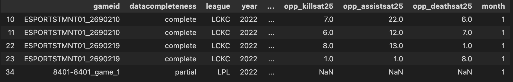

### Analyzing and Predicting First Baron in League of Legends

## Introduction

This project analyzes data from professional League of Legends (LoL) matches, sourced from Oracles Elixir and being the 2022 match dataset. In the dataset is a summary of information to gain an understanding of how a player behaves, team interaction, and match outcomes for individual matches. The central question this project asks is: Does securing the first Baron in a match increases a team likelihood of winning? Why focus on this question is because the Baron Nashor seems to be one of the most impactful neutral objectives in League of Legends. Whichever team that secures the Baron first seems to have gain an advantage over the other team. Using out dataset, is this advantage reflected in higher win rates? If we can understand the relationship between securing first Baron and win rates, then this can possibly help players, coaches or fans of League of Legends to better evaluate game strategies and decisions around the Baron. This project also builds a predictive model to answer a related question: Can we predict whether a team will secure the first Baron base on early game statistics? Hopefully both of these questions will give insight into how players performance early in the match correlates with game objectives later in the match. 

Dataset Summary:
Before filtering, the dataset contains 150588 rows and 161 columns. For our question, we’ll use only relevant columns that are listed here:

•	firstbaron : Whether the team secured the first Baron Nashor (True/False)

•	result: Match result (1 = win, 0 = loss)

•	golddiffat10 : Gold difference between the and opponent at 10 minutes

•	xpdiffat10 : Experience point difference at 10 minutes

•	csdiffat10: Creep Score difference at 10 minutes

•	killsat10 : Number of kills by the team by 10 minutes

•	assistsat10: Number of assists by 10 minutes

•	deathsat10: Number of deaths by 10 minutes

•	dragons: Number of dragons secured by the team during the match

•	barons: : Number of Barons secured by the team during the match

•	vspm: Vision score per minute (measure of map vision control)

•	wardsplaced: Number of wards placed by the team

•	wardskilled: Number of wards secured by the team

•	controlwardsbought: Number of control wards purchased by the team

•	firstherald: Whether the team secured the first Rift Herald (True/False)

•	side: Team side (Blue or Red)

## Data Cleaning and Exploratory Data Analysis

### Data Cleaning

Data Cleaning
Several data cleaning steps were needed to prepare the data for analysis. The steps make sure that the data that’s used is relevant and consistent with the data generating process of League of Legends matches.

Since this project is mostly concerned on team level outcomes, I filtered out player level rows by using the column “participantid”, since team level rows have a participantid of 100 (Blue Team) or 200 (Red team). I then converted columns that should be Boolean, such as storing integers (0/1) or string values, to bool type for consistency. For the “date” column, I converted the original string to a datetime format, allowing us to extract useful time-based features. For some of the columns that contained empty strings or ‘None’ strings, I replaced those with NaN. I also dropped columns that were missing more than 30% of the data, since they wouldn’t contribute reliably. 

The steps for cleaning our dataset ensured that the analyzation and modeling was focused on team level outcomes. That the data types were consistent and had correct analysis. It freed any irrelevant columns or any that didn’t have enough data. After cleaning the data, the dataset contained 25,098 rows with each representing a team in a professional match. 

### Exploratory Data Analysis - Univariate Analysis

This bar chart shows the distribution of First Baron Control. Teams that secured the first Baron were slightly more common, but both outcomes seem to occur commonly. It shows whether out target variable, being “firstbaron”, is balanced in our data because if one of the bars is very tall, then our predictive model could be biased. This balanced distribution is important for the predictive model, because it can learn meaningful patterns than being biased towards one outcome. 

<iframe
  src="assets/first_baron_distribution.html"
  width="800"
  height="500"
  frameborder="0"
></iframe>

This histogram shows the distribution of Gold Difference at 10 Minutes across all matches. We can see that majority of games early on are close, which makes sense with the gold differences being clustered around zero. It appears though that there are some matches where teams gain early leads or deficits. This shows that while many games are balanced early, sometimes substantial gold advantages can happen and may impact the likelihood of controlling later game objectives such as the Baron.

<iframe
  src="assets/gold_difference.html"
  width="800"
  height="500"
  frameborder="0"
></iframe>

### Exploratory Data Analysis - Bivariate Analysis

This box plot shows the relationship between Gold difference at 10 minutes and Match result. Winning teams (1) seem to have a higher gold advantage at 10 minutes, while the losing teams (0) have a neutral or negative difference. This could mean that securing an early gold advantage correlates well with winning the match.

<iframe
  src="assets/gold_diff_vs_result.html"
  width="800"
  height="600"
  frameborder="0"
></iframe>

This box plot shows the relationship between number of dragons secured and match result. From the plot, it seems to suggest that winning teams consistently secured more dragons than losing teams. This supports the importance of objective control for attaining victory. Controlling dragons might likely contribute to power spikes and dominating the map, helping those teams win the match.

<iframe
  src="assets/dragons_vs_result.html"
  width="800"
  height="600"
  frameborder="0"
></iframe>

This box plot examines the relationship between First Baron Control and Game Length. The median game length between whether or not a team secured the first baron looks to be similar around 1800 seconds. This could mean that while the baron is a valuable objective, securing doesn’t always lead to longer matches. Sometimes it might help accelerate a win, or could be secured defensively in longer matches.

<iframe
  src="assets/gamelength_by_firstbaron.html"
  width="800"
  height="600"
  frameborder="0"
></iframe>

This pivot table shows the average game statistics when grouped by whether the team secured the first Baron and whether if they won the match or not. Some of the trends that are revealed from this table shows that teams that have won the game generally secure more dragons, more team kills, and more barons than losing teams. Teams that also secure the first Baron and won the game had the highest average Barons secured (1.25) and a good average in team kills (19.55) and dragons (3.01). The most interesting trend seems to be that teams that secured the first Baron but still lost the game performed better than teams that lost without securing the first Baron. This seems to indicate that that while securing the first Baron help in the game, it doesn’t mean securing victory. These trends seem to reinforce that while the first Baron control is correlated with better performances of playing the objective and team kills, winning the match means converting these advantages into victories. 

<iframe
  src="assets/pivot_table.html"
  width="800"
  height="300"
  frameborder="0"
></iframe>

## Missingness Dependency
In this dataset, I think the column “golddiffat10” is an example of Not Missing At Random (NMAR). The column tells us how much more or less gold a team had compared to their opponent at 10 minutes. But sometimes this value is missing. Likely because some games didn’t even last 10 minutes, because either the game ended early with a surrender, or there was a technical problem. This means the missing values aren’t random, they just might happen often in games that went badly for one team. So, whether this value is missing depends on what was happening in the game. The missing data is connected to the outcome of the game itself. If we had more information, like whether the game ended early or why, then we might be able to call it Missing At Random (MAR) instead, but with the data we have, this appears to be NMAR.

<iframe
  src="assets/missingness_dependency.html"
  width="800"
  height="600"
  frameborder="0"
></iframe>

To check if missing values in “golddiffat10” are connected to other parts of the data, I ran permutation tests. First, I tested whether missing “golddiffat10” depends on how long the game was. The test showed a very small p-value (0.0), meaning the missing values are clearly connected to game length. This means that short games are much more likely to have this value missing, which makes sense because short games may not reach 10 minutes.

Next, I checked if missing “golddiffat10” depends on which side the team was on. This time, the p-value was 1.0, meaning there’s no connection. So whether a team is Blue or Red does not affect if this value is missing.

The plot above shows the test results for game length. The red dashed line is the result from the real data and since it is far away from the bulk of the random results, it confirms that missing “golddiffat10” really depends on game length.

### Hypothesis Testing

Null hypothesis: Securing the first Baron has no effect on the likelihood of winning. Any difference in win rate is due to random chance.

Alternative hypothesis: Securing the first Baron increases the likelihood of winning.

I used a permutation test to compare the win rate of teams that secured first Baron to the win rate of teams that did not. The test statistic I used being The difference in win rate between the two groups. The Significance level being 0.05. The Observed difference in win rate I got is 0.5685. The p-value being 0.00. 

Since the p-value is zero than our signicance level, I reject the null hypothesis. This means there is statistically significant evidence that securing the first Baron is associated with a higher chance of winning the match. While the result might suggest a strong relationship between first Baron and winning, we can’t say with certainty that the Baron causes a team to win. It may also reflect that stronger teams are both more likely to get Baron and to win.

<iframe
  src="assets/hypothesis_test.html"
  width="800"
  height="600"
  frameborder="0"
></iframe>

## Framing a Prediction Problem
For this project, I wanted to predict whether a team will get the first Baron during a match. This is a binary classification problem, so the model predicts either True (team gets first Baron) or False (team does not).

The variable I’m trying to predict is called “firstbaron”.

I picked this because my whole project is about how getting the first Baron affects winning. If we can predict whether a team will get Baron ahead of time, it could help teams make better decisions during the game on what to do.

To measure how well my model works, I will use accuracy. Since the number of True and False cases is about the same, I believe accuracy is a good way to see how many predictions are correct. If one class was much more common, I might have used a different score.

When training the model, I’ll use information that would be known before the first Baron happens. For example, stats like gold difference at 10 minutes, first Herald control, and which side the team is on. I didn’t use anything that happens after Baron, to keep the model realistic.

### Baseline Model
For my baseline model, I built a logistic regression classifier to predict whether a team will get the first Baron. I used the features “golddiffat10”, “firstherald” and “side” in the model. “golddiffat10” is a quantitative numeric feature, “firstherald” is a nominal categorical feature and “side” is a nominal categorical feature. I prepared the data by scaling the quantitative feature “golddiffat10” using StandardScaler and encoded the categorical features “firstherald” and “side” using one-hot encoding. The model performed with an accuracy of 63% and precision and recall were roughly balanced between the two classes. I think this an decent start but not a very good model. It’s better than random guessing but still makes plenty of mistakes, but it’s expected from a baseline model. I think there’s more room to improve such as adding more useful features and trying more advanced models.

### Final Model
For my Final Model, I added several new features that I believe will give the model a better understanding of how the early game is going. This can help predict whether a team will secure the first Baron or not. The features I added are early match stats that describe how well a team is doing before Baron. I added “xpdiffat10”,  “csdiffat10”, “killsat10”, “assistsat10”, “deathsat10”, “vspm”, “wardsplaced”, “wardskilled”, “controlwardsbought”, “gold_xp_ratio” and “cs_per_kill”. “xpdiffat10” shows experience difference at 10 minutes. “csdiffat10” shows creep score difference at 10 minutes. “killsat10”, “assistsat10” and “deathsat10” show combat performance early on. “vspm”, “wardsplaced”, “wardskilled” and “controlwardsbought” are vision control stats, which are very important for controlling the Baron area. “gold_xp_ratio” and “cs_per_kill” are two engineered features that shows balance between gold and XP advantage and shows how objective-focused the team is against fighting. These features are good choices because they describe the team's strength, map control, and momentum in the early game, which strongly influence whether a team is likely to get the first Baron. I chose these features based on game knowledge and how matches usually flow, not based on seeing that they just improve accuracy.

For the classifier for my final model, I used a Random Forest Classifier. This is a flexible model that can handle both numerical and categorical data well, and is good for capturing interactions between features. I then performed a GridSearchCV to tune the hyperparameters n_estimators (tried 100 and 200), max_depth (tried 5, 10, 15, and None), min_samples_split (tried 2, 5, and 10) and max_features (tried 'sqrt' and 'log2'). The best parameters found were max_depth = None, max_features = 'sqrt', min_samples_split = 10 and n_estimators = 200. The performance of the final model improved with an accuracy of 70.3%. Compared to the baseline model, the final model performs better and suggest that adding early game stats and vision related features help better the model better understand which teams are likely to secure the first Baron.

## Fairness Analysis
For the fairness analysis, I wanted to see whether my final model performs differently for Blue teams against Red teams. I chose teams on the red side for Group X and teams on the blue side for Group Y. The evaluation metric I chose was precision because it tells how often the model’s predictions of “this team will get first Baron” are actually correct. It’s a good way to check if the model favors one side over the other. 

Null hypothesis: The model’s precision is the same for Blue side and Red side teams. Any differences are due to random chance.

Alternative hypothesis: The model’s precision is different for Blue side and Red side teams.

I used a permutation test to compare the precision of the model for Blue side and Red side teams. The test statistic I chose is the difference in precision between Blue and Red sides. The signicance level being 0.05. The observed precision for Red was 0.6614 and the observed precision for Blue was 0.6445. The observed difference was 0.0169 and the p-value is 0.5430. Since the p-value is larger than our significance level (p = 0.5430 > 0.05), I fail to reject the null hypothesis.
Which means there is no significant evidence that the model treats Blue side and Red side teams unfairly with respect to precision. 

<iframe
  src="assets/fairness_precision_test.html"
  width="800"
  height="600"
  frameborder="0"
></iframe>

The plot above shows the permutation test results. The red dashed line shows the observed precision difference. Since this value is near the middle of the random distribution, we see that the observed difference is not statistically unusual.
